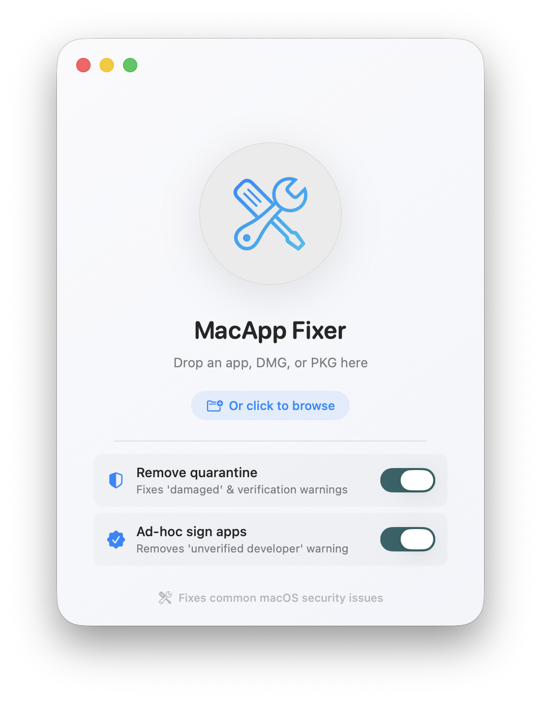

# 🔧 MacApp Fixer

A beautiful macOS native app that fixes common security issues preventing apps and installers from opening.

<p align="center">
  
</p>

## ✨ Features

- 🎯 **Remove Quarantine Attribute** - Fixes "damaged" and verification warnings for apps, DMGs, and PKGs
- ✍️ **Ad-hoc Code Signing** - Fixes "unidentified developer" warnings (for `.app` files only)
- 🖱️ **Drag & Drop or Browse** - Easy-to-use interface
- 🔍 **Smart File Type Detection** - Automatically applies the right operations
- 🎨 **Beautiful macOS Native UI** - Modern design optimized for macOS 26

## 🚀 Quick Start

### Download & Run

> **🎭 The Ironic Moment**: MacApp Fixer itself will likely be blocked by macOS security when you first download it! But don't worry - fixing this is exactly what the app is designed to do. Once you get past this initial hurdle, you can use MacApp Fixer to fix all your other apps. 😄

**To run MacApp Fixer for the first time:**

1. Download the latest release
2. Open **Terminal**
3. Type `xattr -d com.apple.quarantine ` (note the space at the end)
4. Drag and drop `MacAppFixer.app` into the Terminal window
5. Press **Enter**
6. Now you can use MacApp Fixer to fix other apps! 🎉

## 📖 How to Use

1. Launch **MacApp Fixer**
2. Drag and drop any `.app`, `.dmg`, or `.pkg` file onto the window (or click "browse")
3. Choose your options:
   - ✅ **Remove quarantine** (fixes "damaged" warnings) - works on all file types
   - ✅ **Ad-hoc sign apps** (fixes "unverified developer" warnings) - only for `.app` files
4. The app will prompt for your password (required for security operations)
5. Done! Your file should now open without warnings

## 🛠️ Build from Source

### Prerequisites
- macOS 15.0 or later
- Swift 6.0 or later
- Xcode Command Line Tools (optional, for building `.app` bundle)

### Option 1: Run Directly
```bash
git clone https://github.com/itsAllexB/MacApp-Fixer.git
cd MacApp-Fixer
swift run
```

### Option 2: Build .app Bundle
```bash
swift build -c release
```

Then create the `.app` bundle manually or use Xcode:
```bash
open Package.swift  # Opens in Xcode
# Press Cmd+R to build and run
```

### Option 3: Build with Xcode
1. Open the project folder in Xcode
2. It will automatically detect `Package.swift`
3. Select **MacAppFixer** scheme
4. Press `Cmd+R` to run or `Cmd+B` to build

## 🔍 What Each Operation Does

### Remove Quarantine
**Command:** `xattr -d com.apple.quarantine <file>`

Removes the quarantine extended attribute that macOS adds to files downloaded from the internet. This fixes:
- ❌ "App is damaged and can't be opened"
- ❌ "Verifying..." that never completes
- ❌ DMG files that won't mount

**Applies to:** `.app`, `.dmg`, `.pkg`, and other file types

### Ad-hoc Sign
**Command:** `codesign -s - -f --deep <file>`

Re-signs the application with an ad-hoc signature. This fixes:
- ❌ "App can't be opened because it is from an unidentified developer"
- ❌ Code signature issues

**Applies to:** `.app` files only (automatically skipped for DMG/PKG files)

## 🎨 Why This App?

There are many terminal commands out there to fix these issues, but they're not user-friendly for everyone. MacApp Fixer provides:
- 🖱️ **Visual interface** - No terminal knowledge required
- 🎯 **Smart detection** - Automatically knows which operations to apply
- ✨ **Modern design** - Beautiful native macOS UI
- 🔒 **Transparent** - Shows exactly what operations succeeded or failed

## 🔒 Security & Privacy

MacApp Fixer:
- ✅ Runs entirely on your local machine
- ✅ No network connections
- ✅ No data collection
- ✅ Open source - you can verify the code yourself
- ✅ Uses macOS's built-in `xattr` and `codesign` tools
- ⚠️ Requires admin privileges (only for the operations, not the app itself)

## 📋 Supported File Types

| File Type | Remove Quarantine | Ad-hoc Sign |
|-----------|-------------------|-------------|
| `.app`    | ✅ Yes            | ✅ Yes      |
| `.dmg`    | ✅ Yes            | ❌ No       |
| `.pkg`    | ✅ Yes            | ❌ No       |

## ⚠️ Limitations

- **Ad-hoc signing** creates a local signature that only works on your Mac. It won't work if you share the app with others.
- **Notarization** is not possible without an Apple Developer ID certificate ($99/year).
- Some apps may still require additional fixes beyond what this tool provides.
- System Integrity Protection (SIP) prevents modifying system apps.

## 🙏 Why Do I Need This?

macOS Gatekeeper is designed to protect you from malicious software. However, it can be overly aggressive with legitimate software:
- Open-source projects without Developer ID certificates
- Internal company tools
- Apps from smaller developers
- Older software that hasn't been updated

This tool helps you take control of your Mac while understanding the security implications.

## 📄 License

MIT License - See [LICENSE](LICENSE) file for details

## 🤝 Contributing

Contributions are welcome! Please feel free to submit a Pull Request.

## 👤 Author

**AllexB**

---

**Disclaimer:** Use this tool responsibly. Only remove security restrictions from apps you trust. Running unverified code can be dangerous.
